# Lab 2: Intro to ECS

## Creating the ALB

Now that we've pushed our images, we need an Application Load Balancer [ALB](https://aws.amazon.com/elasticloadbalancing/applicationloadbalancer/) to route traffic to our endpoints. An ALB lets you direct traffic between different endpoints and in this lab, we&#39;ll use two separate endpoints: _/web_ and _/api_.

To create the ALB, navigate to the [EC2 Console](https://console.aws.amazon.com/ec2/v2/home?#LoadBalancers:sort=loadBalancerName), and select **Load Balancers** from the left-hand menu. Choose **Create Load Balancer**.  Create an Application Load Balancer:

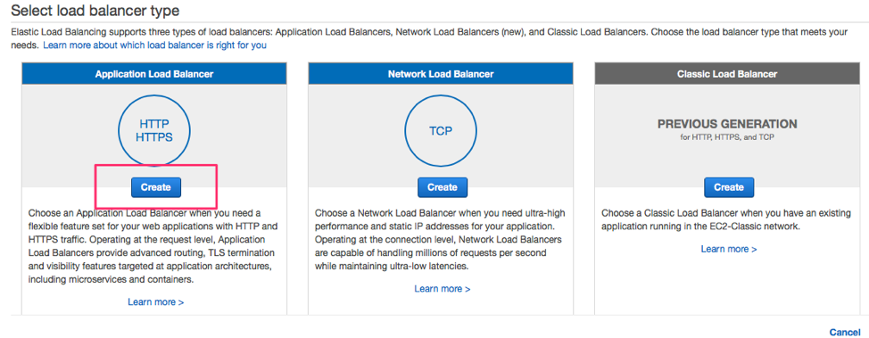

Name your ALB **EcsLabAlb** and add an HTTP listener on port 80:

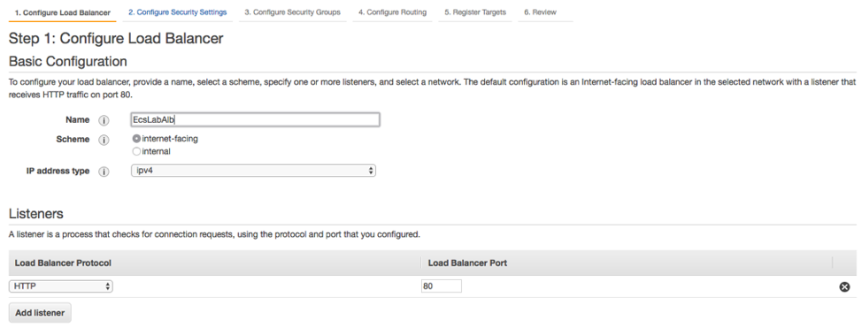

**Note** : in a production environment, you should also have a secure listener on port 443. This will require an SSL certificate, which can be obtained from [AWS Certificate Manager](https://aws.amazon.com/certificate-manager/), or from your registrar/CA. For the purposes of this lab, we will only create the insecure HTTP listener. DO NOT RUN THIS IN PRODUCTION.

Next, select your VPC and we need at least two subnets for high availability. Make sure to choose the VPC that was used in Lab 1.

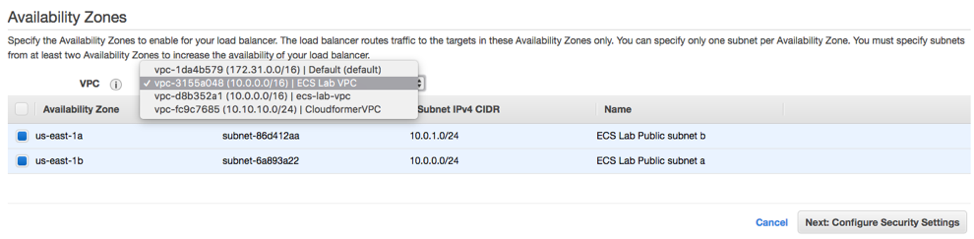

Click **Next** , and create a new security group (_sgecslabloadbalancer_) with the following rule:

|Ports|Protocol|Source|
|:-:|:-:|:-:|
|80| tcp|0.0.0.0/0|

Continue to the next step: **Configure Routing**. For this initial setup, we're just adding a dummy health check on `/`. We'll add specific health checks for our service endpoints when we register them with the ALB.

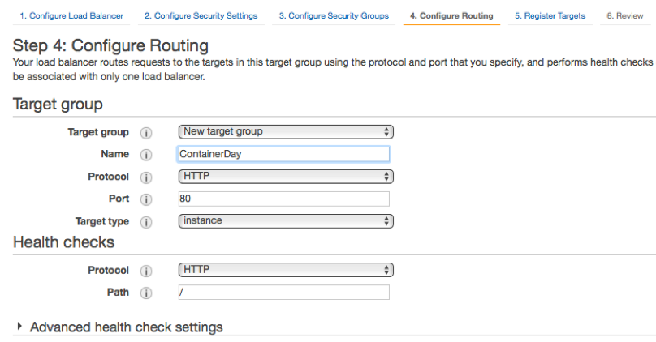

Click through the **Next:Register targets** step, and continue to the **Review** step. If your values look correct, click **Create**.

Note: If you created your own security group for the ECS Cluster ([sgecslabpubliccluster](https://console.aws.amazon.com/ec2/v2/home?#SecurityGroups:search=sgecslabpubliccluster;sort=tag:Name)), and only added a rule for port 80, you'll need to add one more. Edit your security group and add a rule to allow your ALB security group (_sgecslabloadbalancer_) to access the port range for `ECS (0-65535)` for port mapping. This rule references itself and you will see the security group appears when you start typing "`sg-`" in the Source textbox for the All TCP rule.

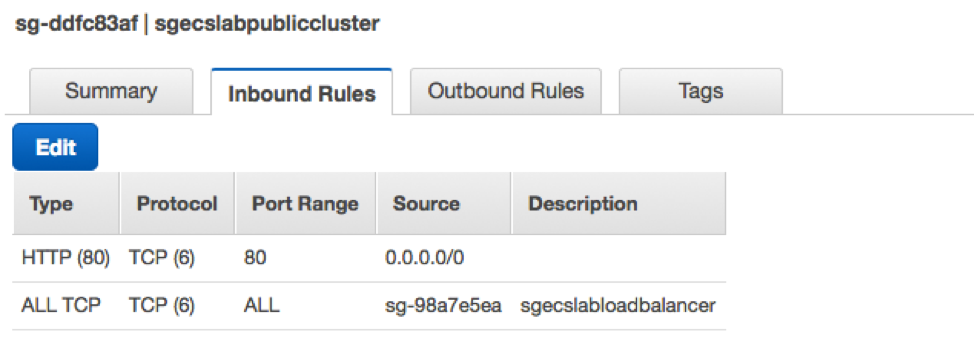

We now have the following security group setup:

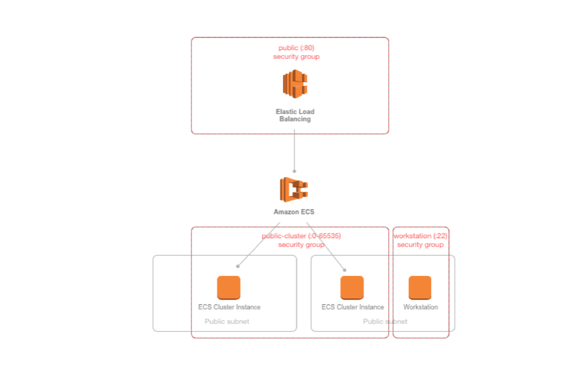

## 10. Creating the Task Definitions

We need to create a service in ECS but before that can be done, the container needs be a part of a [Task Definition](https://docs.aws.amazon.com/AmazonECS/latest/developerguide/create-task-definition.html). Task Definitions define things like environment variables, the container image you wish to use, and the resources you want to allocate to the service (port, memory, CPU). To create a Task Definition, choose [Task Definitions](https://console.aws.amazon.com/ecs/home?taskDefinitions&amp;region=us-east-1#/taskDefinitions) from the ECS console menu. Then, choose **Create a Task Definition**. For launch type compatibility, select EC2, **Next Step**.

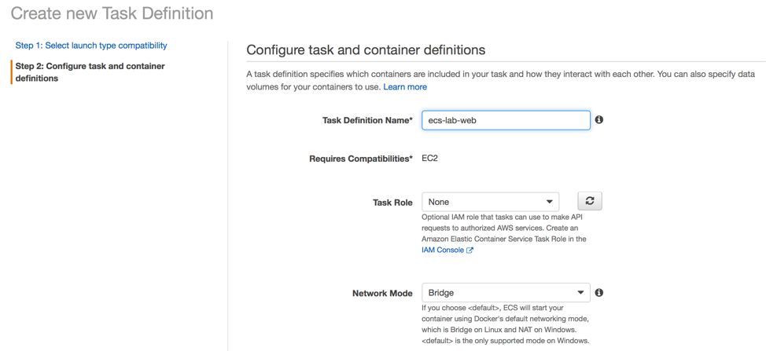

Scroll down and leave the default values for the &quot;Task execution IAM role&quot; and &quot;Task size&quot; sections.  Click on the **Add Container** button. Use _ecs-lab-web_ for **Container name**. In the **Image** textbox, paste the Image URI that you used to push the web image to ECR from the previous lab.  You can also find the web URI in the ECR web repo (look for the value for **Repository URI** ). For **Memory Limit** , use a value of 128.

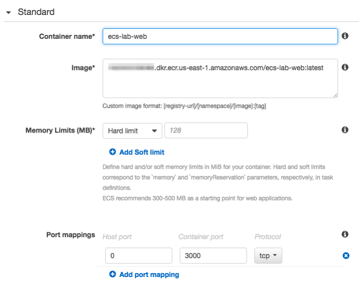

A few things to note here:

- We&#39;ve specified a specific container image, including the :latest tag. Although it&#39;s not important for this lab, in a production environment where you were creating Task Definitions programmatically from a CI/CD pipeline, Task Definitions could include a specific SHA hash, or a more accurate tag.
- Under **Port Mappings** , we&#39;ve specified a **Container Port** (3000), but left **Host Port** as 0. This is required to facilitate dynamic port allocation. This means that we don&#39;t need to map the Container Port to a specific Host Port in our Container Definition; instead, we can let the ALB allocate a port during task placement. To learn more about port allocation, check out the [ECS documentation here](http://docs.aws.amazon.com/AmazonECS/latest/APIReference/API_PortMapping.html).

Once you&#39;ve specified your Port Mappings, scroll down and add a log driver. There are a few options here, but for this lab, choose **awslogs** :

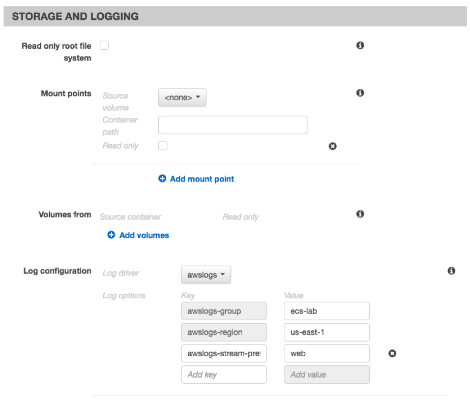

For this web container, make sure the **awslogs-stream-prefix** is **web**. Once you&#39;ve added your log driver, save the Container Definition by clicking **Add** , and click on Create to complete the Task Definition.

Repeat the Task Definition creation process with the API container, taking care to use the api container image registry, and the correct port (8000) for the **Container Port** option. For the log driver, make sure the **awslogs-stream-prefix** is **api**.

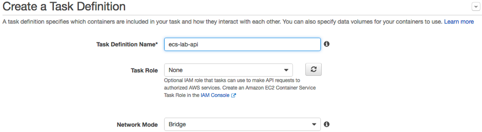
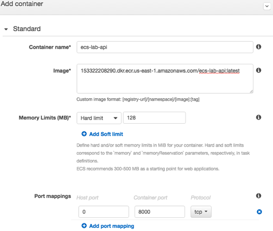
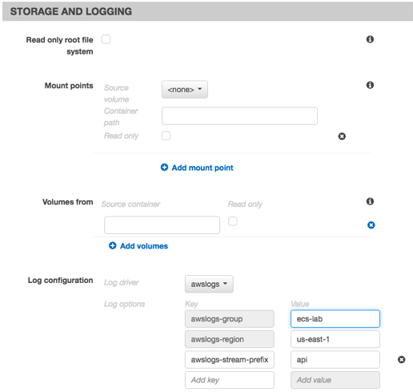

Don&#39;t forget to click on the **Create** button to complete the Task Definition.

Next, create the log group by navigating to the [CloudWatch](https://console.aws.amazon.com/cloudwatch) **\&gt; Logs \&gt; Actions \&gt; Create Log Group**

| **Field** | **Value** |
| --- | --- |
| Log Group Name | ecs-lab |

## 11. Creating the Services

Next, we&#39;re going to create the service based on our Task Definition. A service is a group of tasks (which are containers). You can define how many tasks you want to run simultaneously, specify load balancing, auto scaling and configure many other options.

First, we need to create a IAM role for this Service. Navigate to [IAM](https://console.aws.amazon.com/iam/) > **Roles** >  **Create new role**:

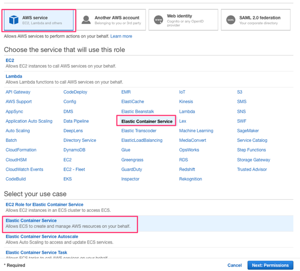

Click **Next: Permissions**

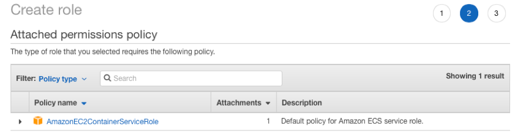

Click **Next:Review**.  In the Review page, use **EcsLabServiceRole** for the role name and click the **Create Role** button.

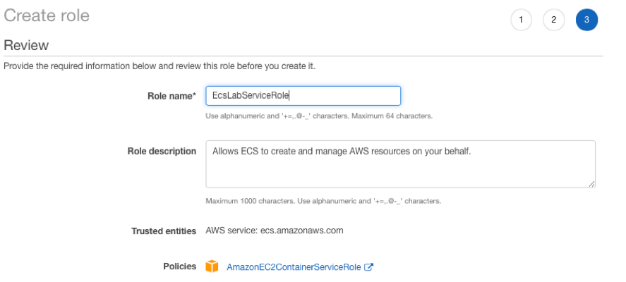

Navigate back to the [ECS console](https://console.aws.amazon.com/ecs/home?taskDefinitions&amp;region=us-east-1#/clusters), and choose the cluster that you created. This should be named **EcsLabPublicCluster**. From the cluster detail page, choose **Services** \&gt; **Create**.  Make sure the launch type is EC2 (not Fargate) and configure the service as follows:

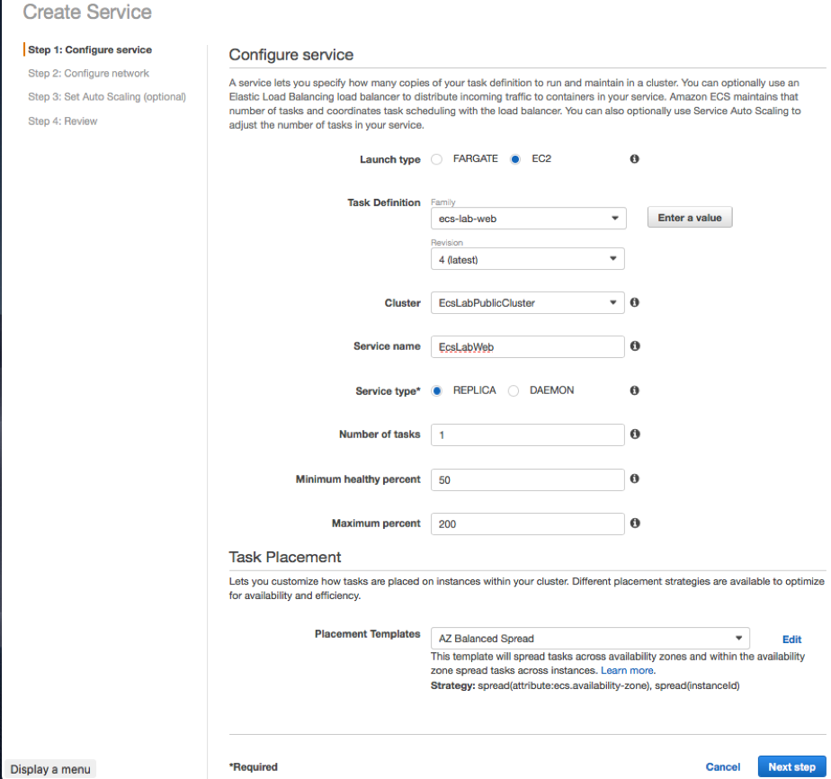

Choose the web Task Definition you created in the previous section. For the purposes of this lab, we&#39;ll only start one copy of each task. In a production environment, you will always want more than one copy of each task running for reliability and availability.

You can keep the default **AZ Balanced Spread** for the Task Placement Policy. To learn more about the different Task Placement Policies, see the [documentation](http://docs.aws.amazon.com/AmazonECS/latest/developerguide/task-placement-strategies.html), or this [blog post](https://aws.amazon.com/blogs/compute/introducing-amazon-ecs-task-placement-policies/). Click **Next step** to configure load balancing.

Choose Application Load Balancer and configure as follows:

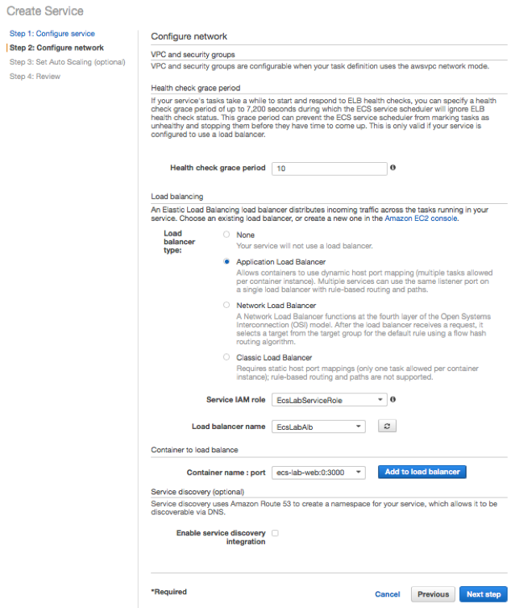

Select the web container, choose **Add to load balancer** and configure load balancing.

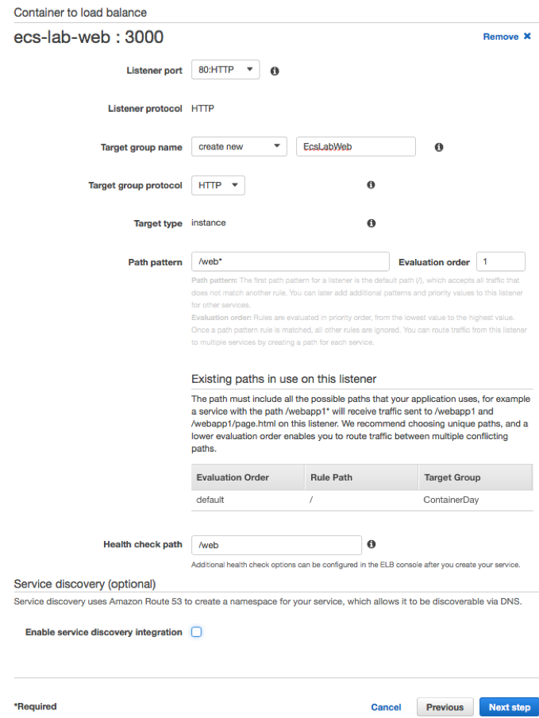

When we created our ALB, we only added a listener for HTTP:80. Select this from the dropdown as the value for **Listener**. For **Target Group Name** , enter a value that will make sense to you later, like **ecs-lab-web**. For **Path Pattern** , the value should be **/web**. This is the route that we specified in our Python application.

If the values look correct, click **Next Step** , click through the optional Auto Scaling page click **Create Service.**

Repeat this process for the api microservice and task definition. Don't forget to adjust the target group name, path pattern, evaluation order and health check path accordingly.

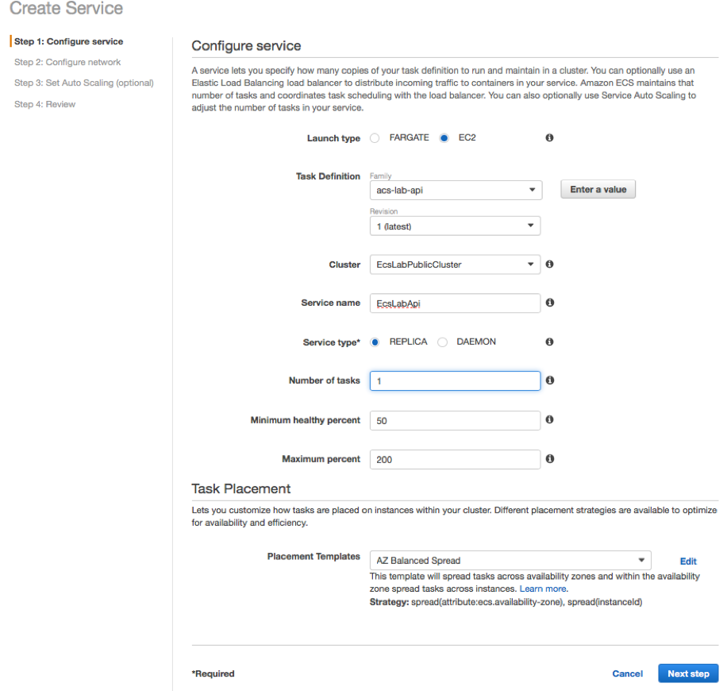
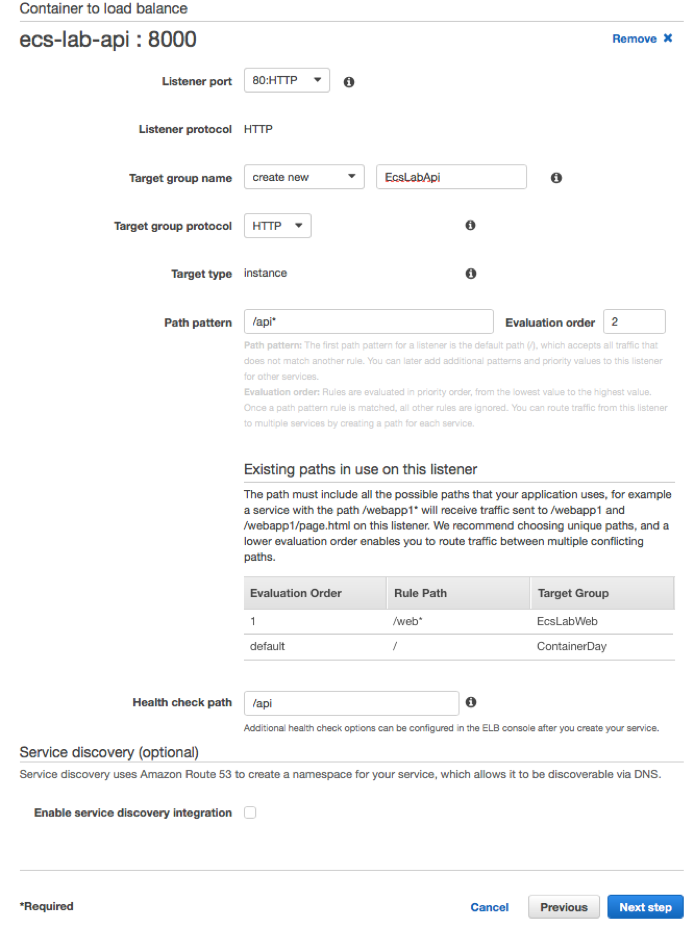

## 12. Testing our service deployments from the console and the ALB

You can see service level events from the ECS console. This includes deployment events. You can test that both of your services are deployed and registered properly with the ALB by looking at the service's **Events** tab:

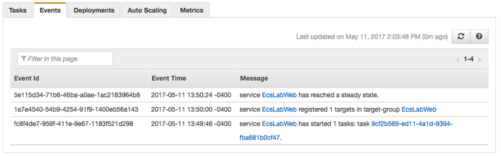

We can also test from the ALB itself. To find the DNS A record for your ALB, navigate to the EC2 Console > **Load Balancers** > **Select your Load Balancer**. Under **Description** , you can find details about your ALB, including a section for **DNS Name**. You can enter this value in your browser, and append the endpoint of your service, to see your ALB and ECS Cluster in action:

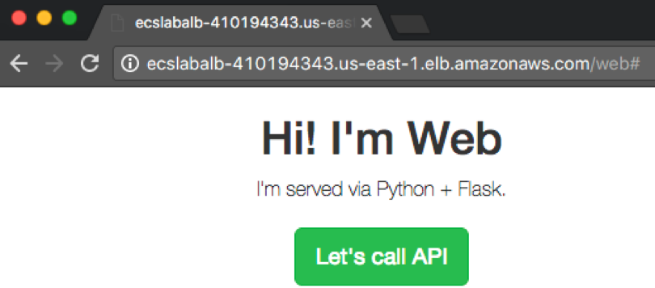
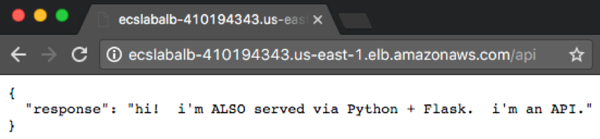

The ALB routes traffic appropriately based on the paths we specified when we registered the containers: /web\* requests go to our web service, and /api\* requests go to our API service.

## 13. More in-depth logging with CloudWatch

When we created our Container Definitions, we also added the awslogs driver, which sends logs to [CloudWatch](https://aws.amazon.com/cloudwatch/). You can see more details logs for your services by going to the CloudWatch console, and selecting first our log group ecs-lab and then choosing an individual stream:

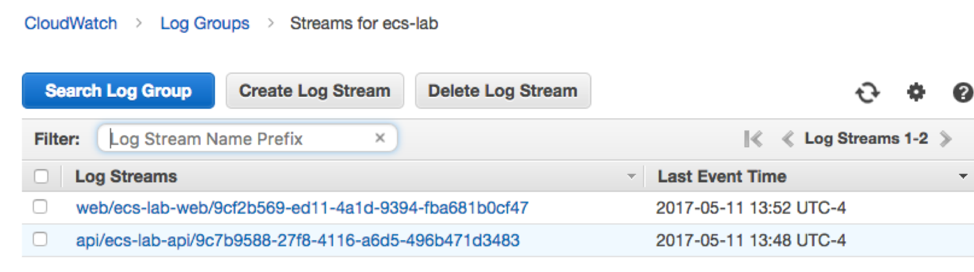

## That's a wrap!

Congratulations! You've deployed an ECS Cluster with two working endpoints.

## Clean up

Don't forget to do the following, after you're finished with the lab:

- Delete the ecs-lab stack
- Go to **CloudWatch Console > Logs** and delete Log Group ecs-lab
- Go to **ECS Console > Repositories** and delete the cluster, deregister the 2 task definitions, delete the 2 created repositories
- Go to the **EC2 Console** , terminate the ecs-lab-workstation EC2 Instance, the Application Load Balancer and the 3 Target Groups
- Go to **IAM console** and delete the 2 roles EcslabInstanceRole and EcsWorkstationRole

## Find the above a little boring?

Here are some ideas to make it more interesting:

- The development team refactored our api and now it requires a host with GPU. Deploy the api containers to EC2 P2 GPU instances by defining a [Task Placement Constraint](http://docs.aws.amazon.com/AmazonECS/latest/developerguide/cluster-query-language.html).
