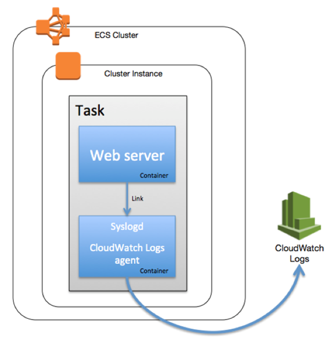

### ECS CloudWatch Logs Lab

When building applications on ECS, it is a good practice to follow a micro services approach, which encourages the design of a single application component in a single container. This design improves flexibility and elasticity, while leading to a loosely coupled architecture for resilience and ease of maintenance. However, this architectural style makes it important to consider how your containers will communicate and share data with each other.

### Why is it useful?

Application logs are useful for many reasons. They are the primary source of troubleshooting information. In the field of security, they are essential to forensics. Web server logs are often leveraged for analysis (at scale) in order to gain insight into usage, audience, and trends.

Centrally collecting container logs is a common problem that can be solved in a number of ways. The Docker community has offered solutions such as having working containers map a shared volume; having a log-collecting container; and getting logs from a container that logs to stdout/stderr and retrieving them with docker logs.

In this lab, we present a solution using [Amazon CloudWatch Logs](https://docs.aws.amazon.com/AmazonCloudWatch/latest/DeveloperGuide/WhatIsCloudWatchLogs.html). CloudWatch is a monitoring service for AWS cloud resources and the applications you run on AWS. CloudWatch Logs can be used to collect and monitor your logs for specific phrases, values, or patterns. For example, you could set an alarm on the number of errors that occur in your system logs or view graphs of web request latencies from your application logs. The additional advantages here are that you can look at a single pane of glass for all of your monitoring needs because such metrics as CPU, disk I/O, and network for your container instances are already available on CloudWatch.

### Here is how we are going to do it

Our approach involves setting up a container whose sole purpose is logging. It runs [rsyslog](http://www.rsyslog.com/) and the CloudWatch Logs agent, and we use [Docker Links](https://docs.docker.com/userguide/dockerlinks/) to communicate to other containers. With this strategy, it becomes easy to link existing application containers such as Apache and have discrete logs per task. This logging container is defined in each ECS [task definition](https://docs.aws.amazon.com/AmazonECS/latest/developerguide/task_defintions.html), which is a collection of containers running together on the same container instance. With our container log collection strategy, you do not have to modify your Docker image. Any log mechanism tweak is specified in the task definition.



**Note:**  Please note that we are using the US East (N. Virginia) region throughout this exercise. If you would like to use a different AWS region, please make sure to update your configuration accordingly.

### Linking to a CloudWatch logging container

We will create a container that can be deployed as a syslog host. It will accept standard syslog connections on 514/TCP to rsyslog through container links, and will also forward those logs to CloudWatch Logs via the CloudWatch Logs agent. The idea is that this container can be deployed as the logging component in your architecture (not limited to ECS; it could be used for any centralized logging).

As a proof of concept, we show you how to deploy a container running httpd, clone some static web content (for this example, we clone the ECS documentation), and have the httpd access and error logs sent to the rsyslog service running on the syslog container via container linking. We also send the Docker and ecs-agent logs from the EC2 instance the task is running on. The logs in turn are sent to CloudWatch Logs via the CloudWatch Logs agent.

**Note:**  Be sure to replace your information througout the document as necessary (for example: replace &quot;my\_docker\_hub\_repo&quot; with the name of your own Docker Hub repository).

We also assume that all following requirements are in place in your AWS account:

- A VPC exists for the account
- There is an IAM user with permissions to launch EC2 instances and create IAM policies/roles
- SSH keys have been generated
- Git and Docker are installed on the image building host
- The user owns a [Docker Hub](https://hub.docker.com/) account and a repository (&quot;my\_docker\_hub\_repo&quot; in this document)

Let's get started.

### Create the Docker image

The first step is to create the Docker image to use as a logging container. For this, all you need is a machine that has Git and Docker installed. You could use your own local machine or an EC2 instance.

1. Install Git and Docker. The following steps pertain to the Amazon Linux AMI but you should follow the Git and Docker installation instructions respective to your machine.

```
$ sudo yum update -y && sudo yum -y install git docker
```

2. Make sure that the Docker service is running:

```
$ sudo service docker start
```

3. Clone the GitHub repository containing the files you need:

```
$ git clone https://github.com/awslabs/ecs-cloudwatch-logs.git
$ cd ecs-cloudwatch-logs
```

You should now have a directory containing two .conf files and a Dockerfile. Feel free to read the content of these files and identify the mechanisms used.


4. Log in to Docker Hub:

```
$ sudo docker login
```

5. Build the container image (replace the _my\_docker\_hub\_repo_ with your repository name):

```
$ sudo docker build -t _my\_docker\_hub\_repo_/cloudwatchlogs .
```

6. Push the image to your repo:

```
$ sudo docker push _my\_docker\_hub\_repo_/cloudwatchlogs
```

Use the build-and-push time to dive deeper into what will live in this container. You can follow along by reading the [Dockerfile](https://github.com/awslabs/ecs-cloudwatch-logs/blob/master/Dockerfile). Here are a few things worth noting:

- The first RUN updates the distribution and installs rsyslog, pip, and curl.
- The second RUN downloads the AWS CloudWatch Logs agent.
- The third RUN enables remote conncetions for rsyslog.
- The fourth RUN removes the local6 and local7 facilities to prevent duplicate entries. If you don&#39;t do this, you would see every single apache log entry in /var/log/syslog.
- The last RUN specifies which output files will receive the log entries on local6 and local7 (e.g., &quot;if the facility is local6 and it is tagged with httpd, put those into this httpd-access.log file&quot;).
- We use [Supervisor](https://docs.docker.com/articles/using_supervisord/) to run more than one process in this container: rsyslog and the CloudWatch Logs agent.
- We expose port 514 for rsyslog to collect log entries via the Docker link.

### Create an ECS cluster

Now, create an ECS cluster. One way to do so could be to use the Amazon ECS console first run wizard. For now, though, all you need is an ECS cluster.

7. Navigate to the [ECS console](https://console.aws.amazon.com/ecs/home) and choose Create cluster. Give it a unique name that you have not used before (such as &quot;ECSCloudWatchLogs&quot;), and choose Create.

### Create an IAM role

The next five steps set up a CloudWatch-enabled IAM role with EC2 permissions and spin up a new container instance with this role. All of this can be done manually via the console or you can run a CloudFormation template. To use the CloudFormation template, navigate to [CloudFormation console](https://console.aws.amazon.com/cloudformation), create a new stack by using [this template](https://github.com/awslabs/ecs-cloudwatch-logs/blob/master/ecs-cwlogs-template.json) and go straight to step 14 (just specify the ECS cluster name used above, choose your preferred instance type and select the appropriate EC2 SSH key, and leave the rest unchanged). Otherwise, continue on to step 8.

8. Create an IAM policy for CloudWatch Logs and ECS: point your browser to the [IAM console](https://console.aws.amazon.com/iam/home?region=us-east-1), choose  **Policies ** and then  **Create Policy**. Choose  **Select ** next to  **Create Your Own Policy**. Give your policy a name (e.g., ECSCloudWatchLogs) and paste the text below as the Policy Document value.


```
{
  "Version": "2012-10-17",
  "Statement": [
    {
      "Action": [
        "logs:Create*",
        "logs:PutLogEvents"
        ],
      "Effect": "Allow",
      "Resource": "arn:aws:logs:*:*:*"
    },
    {
      "Action": [
        "ecs:CreateCluster",
        "ecs:DeregisterContainerInstance",
        "ecs:DiscoverPollEndpoint",
        "ecs:RegisterContainerInstance",
        "ecs:Submit*",
        "ecs:Poll"
      ],
      "Effect": "Allow",
      "Resource": "*"
    }
  ]
}

```


9. Create a new IAM EC2 service role and attach the above policy to it. In IAM, choose  **Roles** ,  **Create New Role**. Pick a name for the role (e.g., ECSCloudWatchLogs). Choose  **Role Type** ,  **Amazon EC2**. Find and pick the policy you just created, click Next Step, and then  **Create Role**.

### Launch an EC2 instance and ECS cluster

10. Launch an instance with the Amazon ECS AMI and the above role in the US East (N. Virginia) region. On the EC2 console page, choose  **Launch Instance**. Choose  **Community AMIs**. In the search box, type &quot;amazon-ecs-optimized&quot; and choose Select for the latest version (2015.03.b). Select the appropriate instance type and choose  **Next**.

11. Choose the appropriate  **Network** value for your ECS cluster. Make sure that  **Auto-assign Public IP** is enabled. Choose the IAM role that you just created (e.g., ECSCloudWatchLogs). Expand  **Advanced Details**  and in the  **User data**  field, add the following while substituting _your\_cluster\_name_ for the appropriate name:

```
# #!/bin/bash
# echo ECS\_CLUSTER=your\_cluster\_name >> /etc/ecs/ecs.config
# EOF
```


12. Choose  **Next: Add Storage** , then  **Next: Tag Instance**. You can give your container instance a name on this page. Choose  **Next: Configure Security Group**. On this page, you should make sure that both SSH and HTTP are open to at least your own IP address.

13. Choose  **Review and Launch** , then  **Launch and Associate**  with the appropriate SSH key. Note the instance ID.

14. Ensure that your newly spun-up EC2 instance is part of your container instances (note that it may take up to a minute for the container instance to register with ECS). In the [ECS console](https://console.aws.amazon.com/ecs/home), select the appropriate cluster. Select the  **ECS Instances**  tab. You should see a container instance with the instance ID that you just noted after a minute.

15. On the left pane of the ECS console, choose  **Task Definitions** , then  **Create new Task Definition**. On the JSON tab, paste the code below, overwriting the default text. Make sure to replace &quot;_my\_docker\_hub\_repo_&quot; with your own Docker Hub repo name and choose  **Create**.
 
```
{
  "volumes": [
    {
      "name": "ecs_instance_logs",
      "host": {
        "sourcePath": "/var/log"
      }
    }
  ],
  "containerDefinitions": [
    {
      "environment": [],
      "name": "cloudwatchlogs",
      "image": "my_docker_hub_repo/cloudwatchlogs",
      "cpu": 50,
      "portMappings": [],
      "memory": 64,
      "essential": true,
      "mountPoints": [
        {
          "sourceVolume": "ecs_instance_logs",
          "containerPath": "/mnt/ecs_instance_logs",
          "readOnly": true
        }
      ]
    },
    {
      "environment": [],
      "name": "httpd",
      "links": [
        "cloudwatchlogs"
      ],
      "image": "httpd",
      "cpu": 50,
      "portMappings": [
        {
	  "containerPort": 80,
          "hostPort": 80
        }
      ],
      "memory": 128,
      "entryPoint": ["/bin/bash", "-c"],      "command": [
        "apt-get update && apt-get -y install wget && echo 'CustomLog "| /usr/bin/logger -t httpd -p local6.info -n cloudwatchlogs -P 514" "%v %h %l %u %t %r %>s %b %{Referer}i %{User-agent}i"' >> /usr/local/apache2/conf/httpd.conf && echo 'ErrorLogFormat "%v [%t] [%l] [pid %P] %F: %E: [client %a] %M"' >> /usr/local/apache2/conf/httpd.conf && echo 'ErrorLog "| /usr/bin/logger -t httpd -p local7.info -n cloudwatchlogs -P 514"' >> /usr/local/apache2/conf/httpd.conf && echo ServerName `hostname` >> /usr/local/apache2/conf/httpd.conf && rm -rf /usr/local/apache2/htdocs/* && cd /usr/local/apache2/htdocs && wget -mkEpnp -nH --cut-dirs=4 http://docs.aws.amazon.com/AmazonECS/latest/developerguide/Welcome.html && /usr/local/bin/httpd-foreground"
      ],
      "essential": true
    }
  ],
  "family": "cloudwatchlogs"
}

```

What are some highlights of this task definition?

- The _sourcePath_ value allows the CloudWatch Logs agent running in the log collection container to access the host-based Docker and ECS agent log files. ** ** You can [change the retention period](https://docs.aws.amazon.com/AmazonCloudWatch/latest/DeveloperGuide/SettingLogRetention.html) in CloudWatch Logs.
- The _cloudwatchlogs_ container is marked _essential_, which means that if log collection goes down, so should the application it is collecting from. Similarly, the web server is marked _essential _as well. You can easily change this behavior.
- The command section is a bit lengthy. Let us break it down:
  - We first install wget so that we can later clone the ECS documentation for display on our web server.
  - We then write four lines to httpd.conf. These are the echo commands. They describe how httpd will generate log files and their format. Notice how we tag (-t httpd) these files with httpd and assign them a specific facility (-p localX.info). We also specify that logger is to send these entries to host -n cloudwatchlogs on port -p 514. This will be handled by linking. Hence, port 514 is left untouched on the machine and we could have as many of these logging containers running as we want.
  - %h %l %u %t %r %\&gt;s %b %{Referer}i %{User-agent}i should look fairly familiar to anyone who has looked into tweaking Apache logs. The initial %v is the server name and it will be replaced by the container ID. This is how we are able to discern what container the logs come from in CloudWatch Logs.
  - We remove the default httpd landing page with rm -rf.
  - We instead use wget to download a clone of the ECS documentation.
  - And, finally, we start httpd. Note that we redirect httpd log files in our task definition at the command level for the httpd image. Applying the same concept to another image would simply require you to know where your application maintains its log files.

Note that we redirect httpd log files in our task definition at the command level for the httpd image. Applying the same concept to another image would simply require you to know where your application maintains its log files.

### Create a service

16. On the services tab in the ECS console, choose  **Create**. Choose the task definition created in step 15, name the service and set the number of tasks to 1. Select  **Create service**.

17. The task will start running shortly. You can press the refresh icon on your service&#39;s Tasks tab. After the status says &quot;Running&quot;, choose the task and expand the httpd container. The container instance IP will be a hyperlink under the  **Network bindings**  section&#39;s External link. When you select the link you should see a clone of the Amazon ECS documentation. You are viewing this thanks to the httpd container running on your ECS cluster.

18. Open the [CloudWatch Logs console](https://console.aws.amazon.com/cloudwatch/home?region=us-east-1#logs:) to view new ecs entries.

### Conclusion

If you have followed all of these steps, you should now have a two container task running in your ECS cluster. One container serves web pages while the other one collects the log activity from the web container and sends it to CloudWatch Logs. Such a setup can be replicated with any other application. All you need is to specify a different container image and describe the expected log files in the command section.
